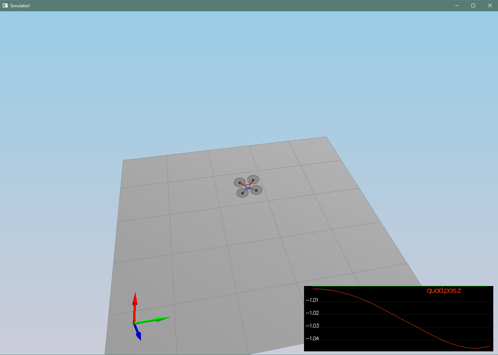
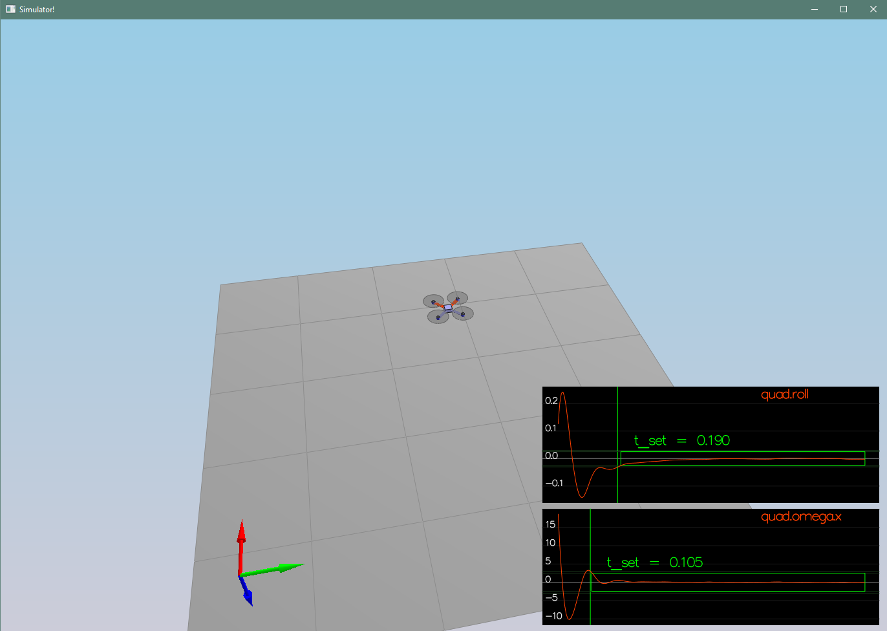
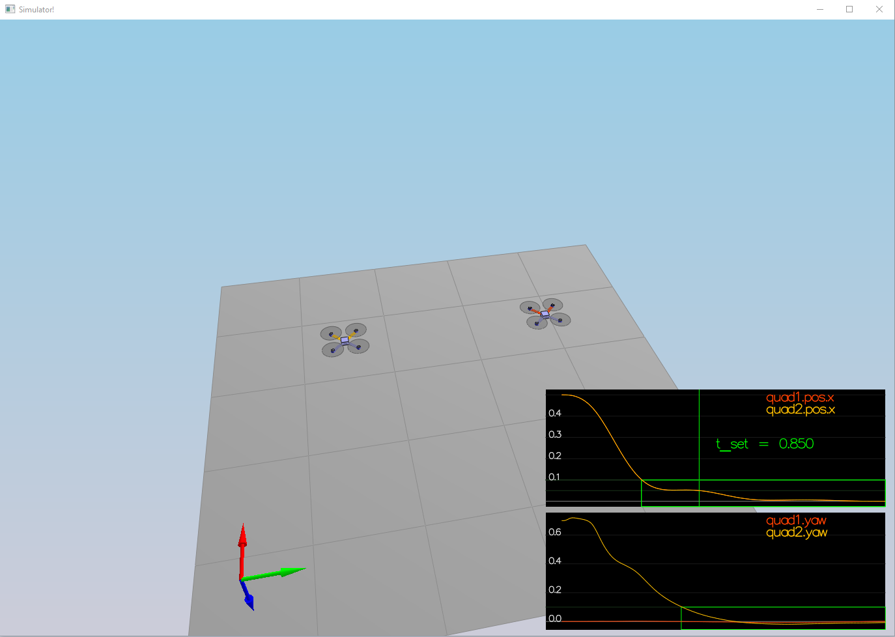
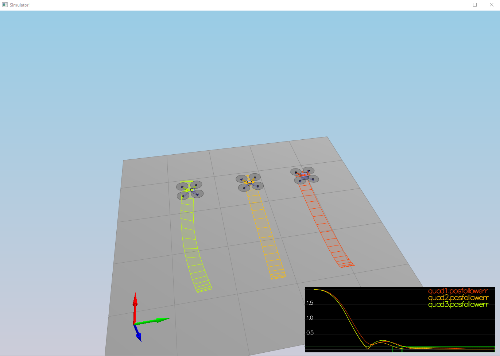
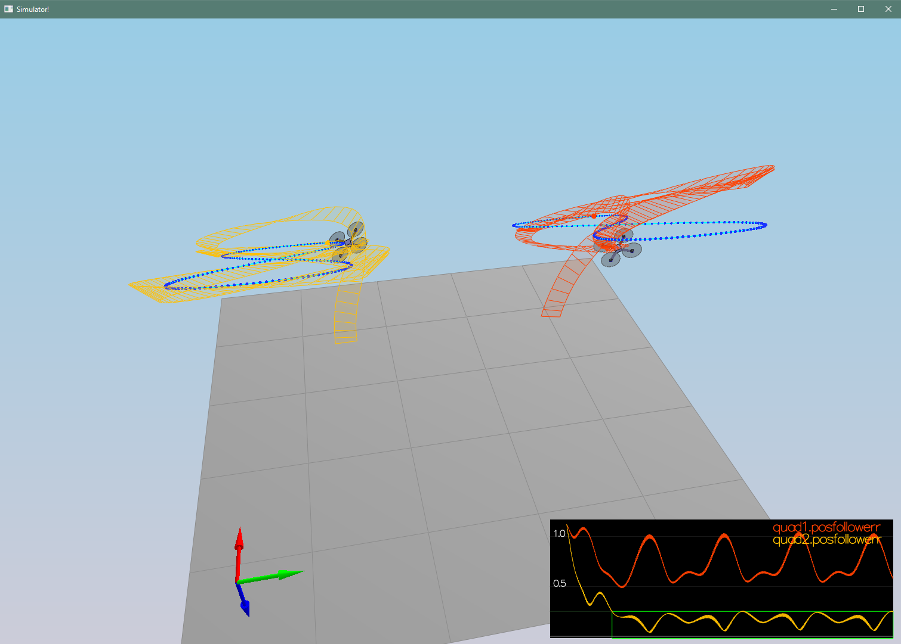
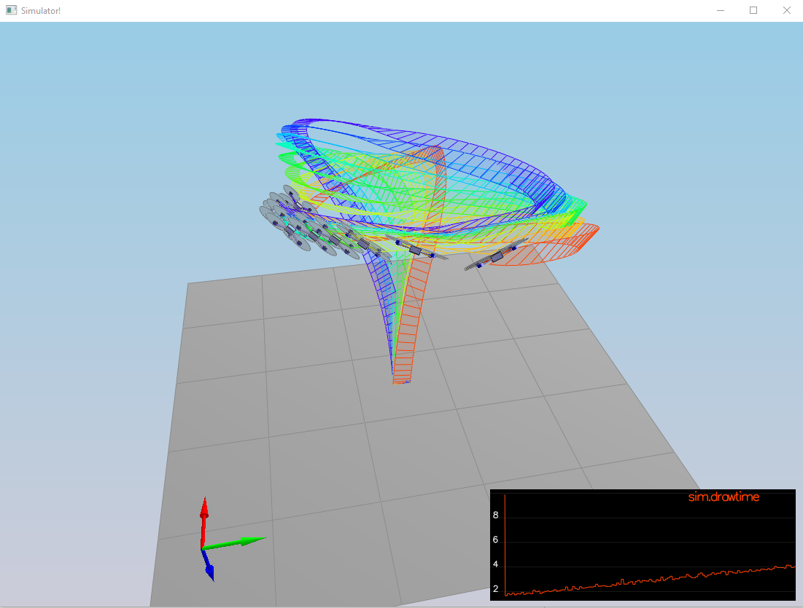

# FCND-Controls
Udacity Flying Car Nanodegree - Project 4 - Building a Controller

## Environment setup
Follow instruction described here ## [Readme](https://github.com/udacity/FCND-Controls-CPP) section Development Environment Setup

### The Code ###

For the project, the majority of your code will be written in `src/QuadControl.cpp`.  This file contains all of the code for the controller that you will be developing.

All the configuration files for your controller and the vehicle are in the `config` directory.  For example, for all your control gains and other desired tuning parameters, there is a config file called `QuadControlParams.txt` set up for you.  An import note is that while the simulator is running, you can edit this file in real time and see the affects your changes have on the quad!

The syntax of the config files is as follows:

 - `[Quad]` begins a parameter namespace.  Any variable written afterwards becomes `Quad.<variablename>` in the source code.
 - If not in a namespace, you can also write `Quad.<variablename>` directly.
 - `[Quad1 : Quad]` means that the `Quad1` namespace is created with a copy of all the variables of `Quad`.  You can then overwrite those variables by specifying new values (e.g. `Quad1.Mass` to override the copied `Quad.Mass`).  This is convenient for having default values.
 
 ### Testing it Out ###
 
 When you run the simulator, you'll notice your quad is falling straight down.  This is due to the fact that the thrusts are simply being set to:
 
 ```
 QuadControlParams.Mass * 9.81 / 4
 ```
 
 Therefore, if the mass doesn't match the actual mass of the quad, it'll fall down.  Take a moment to tune the `Mass` parameter in `QuadControlParams.txt` to make the vehicle more or less stay in the same spot.
 
 Note: if you want to come back to this later, this scenario is "1_Intro".
 
 With the proper mass, the result is as follows:
 


The Mass was experimentally set to
 ```
Mass = 0.495
 ```
 
 ## The Tasks ##
 
 For this project, you will be building a controller in C++.  You will be implementing and tuning this controller in several steps.
 
 You may find it helpful to consult the [Python controller code](https://github.com/udacity/FCND-Controls/blob/solution/controller.py) as a reference when you build out this controller in C++.
 
 #### Notes on Parameter Tuning
 1. **Comparison to Python**: Note that the vehicle you'll be controlling in this portion of the project has different parameters than the vehicle that's controlled by the Python code linked to above. **The tuning parameters that work for the Python controller will not work for this controller**
 
 2. **Parameter Ranges**: You can find the vehicle's control parameters in a file called `QuadControlParams.txt`. The default values for these parameters are all too small by a factor of somewhere between about 2X and 4X. So if a parameter has a starting value of 12, it will likely have a value somewhere between 24 and 48 once it's properly tuned.
 
 3. **Parameter Ratios**: In this [one-page document](https://www.overleaf.com/read/bgrkghpggnyc#/61023787/) you can find a derivation of the ratio of velocity proportional gain to position proportional gain for a critically damped double integrator system. The ratio of `kpV / kpP` should be 4.
 
 ### Body rate and roll/pitch control (scenario 2) ###
 
 First, you will implement the body rate and roll / pitch control.  For the simulation, you will use `Scenario 2`.  In this scenario, you will see a quad above the origin.  It is created with a small initial rotation speed about its roll axis.  Your controller will need to stabilize the rotational motion and bring the vehicle back to level attitude.
 
 To accomplish this, you will:
 
 1. Implement body rate control
 
  - implement the code in the function `GenerateMotorCommands()`
  - implement the code in the function `BodyRateControl()`

For this controller I used the P controller. The implementation is as follows
 ```C++
// P controller
float p_error = pqrCmd.x - pqr.x;
float u_bar_p = kpPQR.x * p_error;

float q_error = pqrCmd.y - pqr.y;
float u_bar_q = kpPQR.y * q_error;

float r_error = pqrCmd.z - pqr.z;
float u_bar_r = kpPQR.z * r_error;

momentCmd.x = Ixx * u_bar_p;
momentCmd.y = Iyy * u_bar_q;
momentCmd.z = Izz * u_bar_r;
 ```
  
  - Tune `kpPQR` in `QuadControlParams.txt` to get the vehicle to stop spinning quickly but not overshoot
 
 The final value of these parameters is
  ```
 kpPQR = 90, 80, 5
 ```
 
You should see the rotation of the vehicle about roll (omega.x) get controlled to 0 while other rates remain zero.  Note that the vehicle will keep flying off quite quickly, since the angle is not yet being controlled back to 0. Also note that some overshoot will happen due to motor dynamics!.
 
 If you come back to this step after the next step, you can try tuning just the body rate omega (without the outside angle controller) by setting `QuadControlParams.kpBank = 0`.
 
 2. Implement roll / pitch control
 We won't be worrying about yaw just yet.
 
  - implement the code in the function `RollPitchControl()`

 ```C++  
if (collThrustCmd > 0.f) {
    float acc = -collThrustCmd / mass;
    float b_x_c_target = CONSTRAIN(accelCmd.x / acc, -maxTiltAngle, maxTiltAngle);
    float b_y_c_target = CONSTRAIN(accelCmd.y / acc, -maxTiltAngle, maxTiltAngle);

    float b_x_err = b_x_c_target - R(0, 2);
    float b_x_p_term = kpBank * b_x_err;

    float b_y_err = b_y_c_target - R(1, 2);
    float b_y_p_term = kpBank * b_y_err;

    float b_x_commanded_dot = b_x_p_term;
    float b_y_commanded_dot = b_y_p_term;

    pqrCmd.x = (R(1, 0) * b_x_commanded_dot - R(0, 0) * b_y_commanded_dot) / R(2, 2);
    pqrCmd.y = (R(1, 1) * b_x_commanded_dot - R(0, 1) * b_y_commanded_dot) / R(2, 2);
} else {
    pqrCmd.x = 0.0;
    pqrCmd.y = 0.0;
}  
 ```
  
  - Tune `kpBank` in `QuadControlParams.txt` to minimize settling time but avoid too much overshoot
  
   The final value of these parameters is
```
kpBank = 9
```
 
 If successful you should now see the quad level itself (as shown below), though it’ll still be flying away slowly since we’re not controlling velocity/position!  You should also see the vehicle angle (Roll) get controlled to 0.
 

 
 
 ### Position/velocity and yaw angle control (scenario 3) ###
 
 Next, you will implement the position, altitude and yaw control for your quad.  For the simulation, you will use `Scenario 3`.  This will create 2 identical quads, one offset from its target point (but initialized with yaw = 0) and second offset from target point but yaw = 45 degrees.
 
  - implement the code in the function `LateralPositionControl()`

For this control has been used PD controller
```C++  
  V3F posError = posCmd - pos;
  V3F velError = velCmd - vel;
  
  // Limit speed
  if (velCmd.mag() > maxSpeedXY) {
      velCmd = velCmd.norm() * maxSpeedXY;
  }

  // PD controller
  accelCmd = kpPosXY * posError + kpVelXY * velError + accelCmd;

  if (accelCmd.mag() > maxAccelXY) {
      accelCmd = accelCmd.norm() * maxAccelXY;
  }
```
  - implement the code in the function `AltitudeControl()`
  
 Originally it was used only P controller, but was changed later into PID
```C++
float posZerror = posZCmd - posZ;
float velZError = velZCmd - velZ;
integratedAltitudeError += posZerror * dt;

// PID controller
float acceleration_cmd = kpPosZ * posZerror + KiPosZ * integratedAltitudeError + kpVelZ * velZError + accelZCmd;

float acceleration = (acceleration_cmd - CONST_GRAVITY) / R(2, 2);

thrust = - mass * CONSTRAIN(acceleration, -maxAscentRate / dt, maxDescentRate / dt);
```
  - tune parameters `kpPosZ` and `kpPosZ`
  - tune parameters `kpVelXY` and `kpVelZ`
 
    The final value of these parameters is:
```
  kpPosXY = 30
  kpPosZ = 25
  kpVelXY = 11
  kpVelZ = 9
```
 
 If successful, the quads should be going to their destination points and tracking error should be going down (as shown below). However, one quad remains rotated in yaw.
 
  - implement the code in the function `YawControl()`
  
  For this controll the P controller has been used
```C++
// Ensure the target is within range of 0 to 2 * pi
if (yawCmd > 0) {
    yawCmd = fmodf(yawCmd, M_2_PI);
} else {
    yawCmd = fmodf(yawCmd, -M_2_PI);
}

float yawError = yawCmd - yaw;
if (yawError > M_PI) {
    yawError = yawError - M_2_PI;
} else if (yawError < -M_PI) {
    yawError = yawError + M_2_PI;
}

// P controller
yawRateCmd = kpYaw * yawError;
```

  - tune parameters `kpYaw` and the 3rd (z) component of `kpPQR`
  
      The final value of these parameters is:
```
kpYaw = 2
kpPQR = 90, 80, 5
```
 
 Tune position control for settling time. Don’t try to tune yaw control too tightly, as yaw control requires a lot of control authority from a quadcopter and can really affect other degrees of freedom. This is why you often see quadcopters with tilted motors, better yaw authority!
 

 
 **Hint:**  For a second order system, such as the one for this quadcopter, the velocity gain (`kpVelXY` and `kpVelZ`) should be at least ~3-4 times greater than the respective position gain (`kpPosXY` and `kpPosZ`).
 
 ### Non-idealities and robustness (scenario 4) ###
 
 In this part, we will explore some of the non-idealities and robustness of a controller.  For this simulation, we will use `Scenario 4`.  This is a configuration with 3 quads that are all are trying to move one meter forward.  However, this time, these quads are all a bit different:
  - The green quad has its center of mass shifted back
  - The orange vehicle is an ideal quad
  - The red vehicle is heavier than usual
 
 1. Run your controller & parameter set from Step 3.  Do all the quads seem to be moving OK?  If not, try to tweak the controller parameters to work for all 3 (tip: relax the controller).
 
 2. Edit `AltitudeControl()` to add basic integral control to help with the different-mass vehicle.
 
```C++
float posZerror = posZCmd - posZ;
float velZError = velZCmd - velZ;
integratedAltitudeError += posZerror * dt;

// PID controller
float acceleration_cmd = kpPosZ * posZerror + KiPosZ * integratedAltitudeError + kpVelZ * velZError + accelZCmd;

float acceleration = (acceleration_cmd - CONST_GRAVITY) / R(2, 2);

thrust = - mass * CONSTRAIN(acceleration, -maxAscentRate / dt, maxDescentRate / dt);
``` 
 
 3. Tune the integral control, and other control parameters until all the quads successfully move properly.  Your drones' motion should look like this:
 

 
 
 ### Tracking trajectories ###
 
 Now that we have all the working parts of a controller, you will put it all together and test it's performance once again on a trajectory.  For this simulation, you will use `Scenario 5`.  This scenario has two quadcopters:
  - the orange one is following `traj/FigureEight.txt`
  - the other one is following `traj/FigureEightFF.txt` - for now this is the same trajectory.  For those interested in seeing how you might be able to improve the performance of your drone by adjusting how the trajectory is defined, check out **Extra Challenge 1** below!
 
 How well is your drone able to follow the trajectory?  It is able to hold to the path fairly well?
 
 
 
 ### Extra Challenge 1 (Optional) ###
 
 You will notice that initially these two trajectories are the same. Let's work on improving some performance of the trajectory itself.
 
 1. Inspect the python script `traj/MakePeriodicTrajectory.py`.  Can you figure out a way to generate a trajectory that has velocity (not just position) information?
 
 2. Generate a new `FigureEightFF.txt` that has velocity terms
 Did the velocity-specified trajectory make a difference? Why?
 
 With the two different trajectories, your drones' motions should look like this:
 
 
 
 
 ### Extra Challenge 2 (Optional) ###
 
 For flying a trajectory, is there a way to provide even more information for even better tracking?
 
 How about trying to fly this trajectory as quickly as possible (but within following threshold)!
 
 
 
 ### Performance Metrics ###
 
 The specific performance metrics are as follows:
 
  - scenario 2
    - roll should less than 0.025 radian of nominal for 0.75 seconds (3/4 of the duration of the loop)
    - roll rate should less than 2.5 radian/sec for 0.75 seconds
 
  - scenario 3
    - X position of both drones should be within 0.1 meters of the target for at least 1.25 seconds
    - Quad2 yaw should be within 0.1 of the target for at least 1 second
 
 
  - scenario 4
    - position error for all 3 quads should be less than 0.1 meters for at least 1.5 seconds
 
  - scenario 5
    - position error of the quad should be less than 0.25 meters for at least 3 seconds
 
 ## Authors ##
 
 Thanks to Fotokite for the initial development of the project code and simulator.